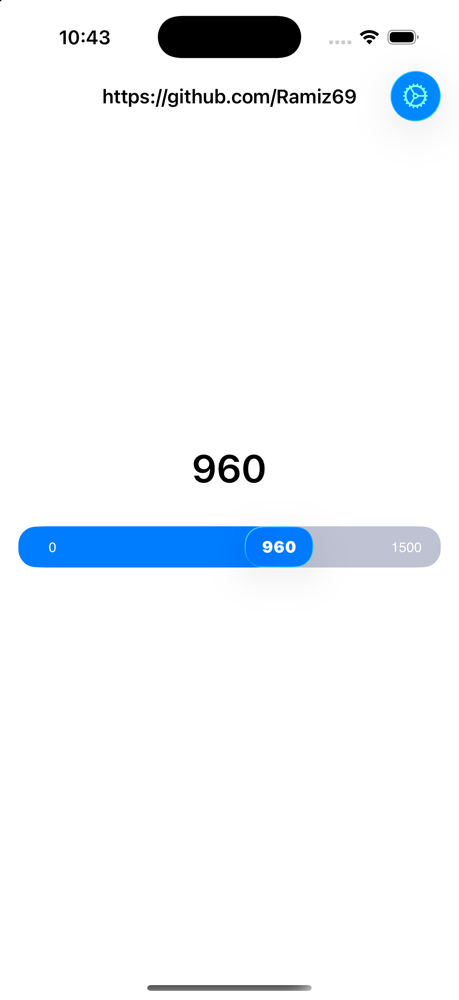
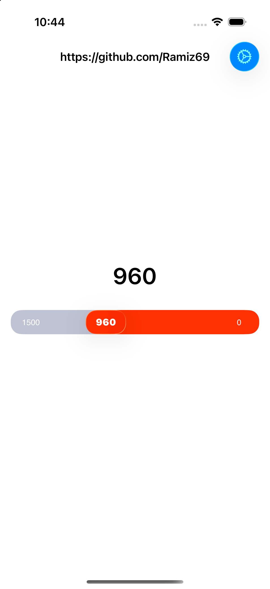
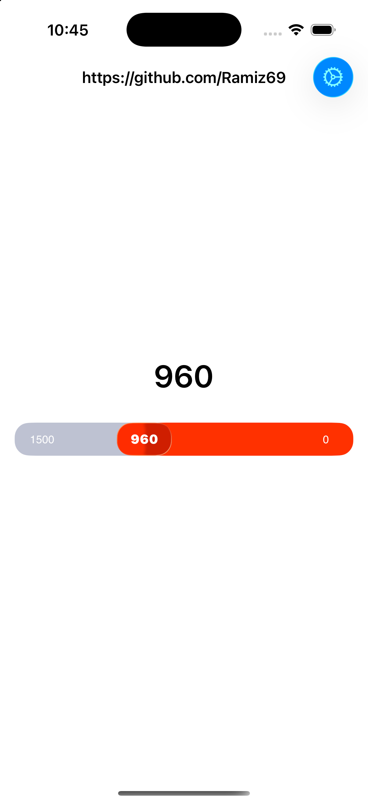
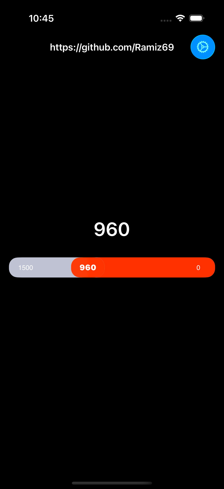
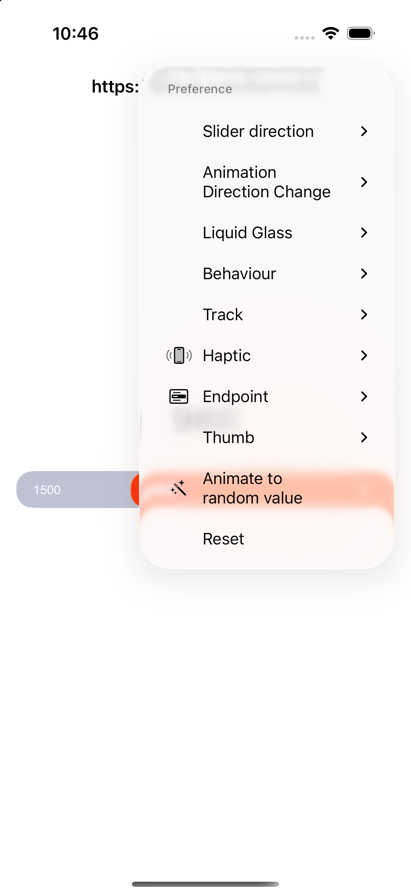

# Slider


[](https://swift.org/package-manager/)

[](https://github.com/Ramiz69/Slider/blob/master/LICENSE)

[](https://swift.org)

- [Installation](#installation)
- [Usage](#usage)
- [Liquid Glass](#liquid-glass)
- [Async API](#async-api)
- [Accessibility](#accessibility)
- [Right to left](#right-to-left)
- [Author](#author)
- [License](#license)

## Requirements

- iOS 18.0+ (Liquid Glass on iOS 26.0+)
- Xcode 27+
- Swift 6.4+ (the package uses `swift-tools-version: 6.4`)

Swift only — the framework no longer ships an Objective-C umbrella header.

## Preview
<details>
  <summary>Preview</summary>

  | Left to right | Right to left |
  | --- | --- |
  |  |  |

  | Clear glass | Dark mode | Preferences |
  | --- | --- | --- |
  |  |  |  |
</details>

## Installation

Slider is distributed through the [Swift Package Manager](https://swift.org/package-manager/) only.

Add it to the `dependencies` value of your `Package.swift`, or to the package list in Xcode
(File ▸ Add Package Dependencies…).

```swift
dependencies: [
    .package(url: "https://github.com/Ramiz69/Slider.git", .upToNextMajor(from: "0.3.0"))
]
```

Normally you'll want to depend on the `Slider` target:

```swift
.product(name: "Slider", package: "Slider")
```

## Usage

```swift
let slider = Slider(direction: .leftToRight)
slider.minimum = 0
slider.maximum = 1500
slider.value = 500
slider.step = 10
slider.translatesAutoresizingMaskIntoConstraints = false
view.addSubview(slider)

slider.addTarget(self, action: #selector(valueChanged), for: .valueChanged)
```

Set `delegate` to control the text shown inside the thumb and at both ends of the track, and to
observe tracking:

```swift
extension ViewController: SliderDelegate {
    func slider(_ slider: Slider, displayTextForValue value: CGFloat) -> String {
        "\(Int(value)) ₽"
    }
}
```

Tapping the track moves the thumb only when you opt in:

```swift
slider.allowsTapToSeek = true
```

## Liquid Glass

On iOS 26 and later the thumb is rendered with `UIGlassEffect` inside a
`UIGlassContainerEffect`, so it refracts the track and merges with it near the ends. Older
systems keep the flat appearance, and the same code runs on both:

```swift
slider.glassConfiguration = GlassConfiguration(
    style: .regular,          // or .clear
    isInteractive: true,      // the material reacts while dragging
    appliesToTrack: false     // opt the track background into the material too
)
```

Opt out entirely with `GlassConfiguration(mode: .disabled)`. The thumb label color is picked for
contrast against the material; override it with `ThumbConfiguration(textColor:)`.

## Async API

```swift
// Resumes once the animation has finished.
await slider.setValue(750, animated: true)

// Observe every change as an asynchronous sequence.
for await value in slider.valueStream {
    print(value)
}

// Warm up the haptic engine so the first touch is not delayed.
await slider.prepareHaptics()
```

## Accessibility

The slider is an adjustable accessibility element: VoiceOver reads its value through the
delegate's display text, and swiping up or down moves it by one `step` (or by 1% of the range
when `step` is zero).

## Right to left

Horizontal directions follow the interface layout direction: in a right-to-left locale
`leftToRight` is rendered right to left, the way `UISlider` behaves. Vertical directions are
never mirrored. Read `resolvedDirection` for the direction actually used, and opt out to pin the
slider to the direction you assigned:

```swift
slider.respectsLayoutDirection = false
```

## Author

ramiz69, ramiz161@icloud.com

## License

Slider is available under the MIT license. [See LICENSE](https://github.com/Ramiz69/Slider/blob/master/LICENSE) for details.
